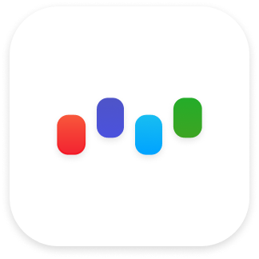
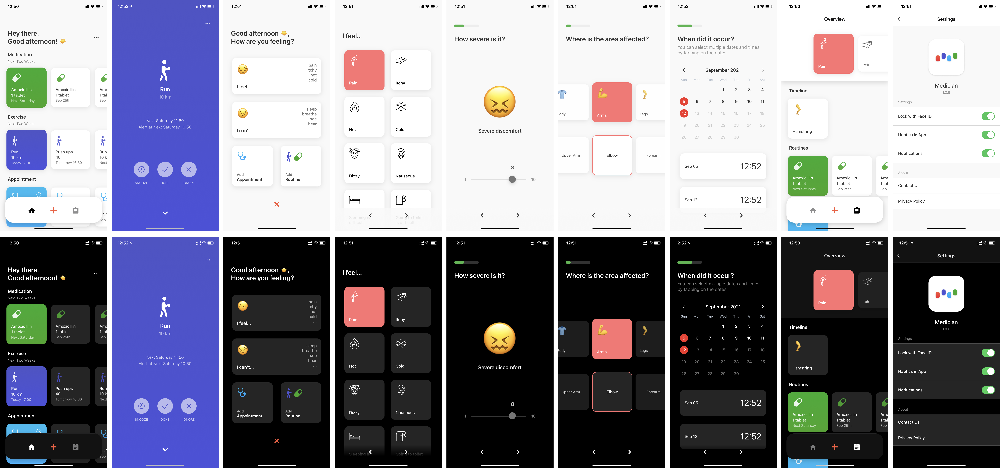
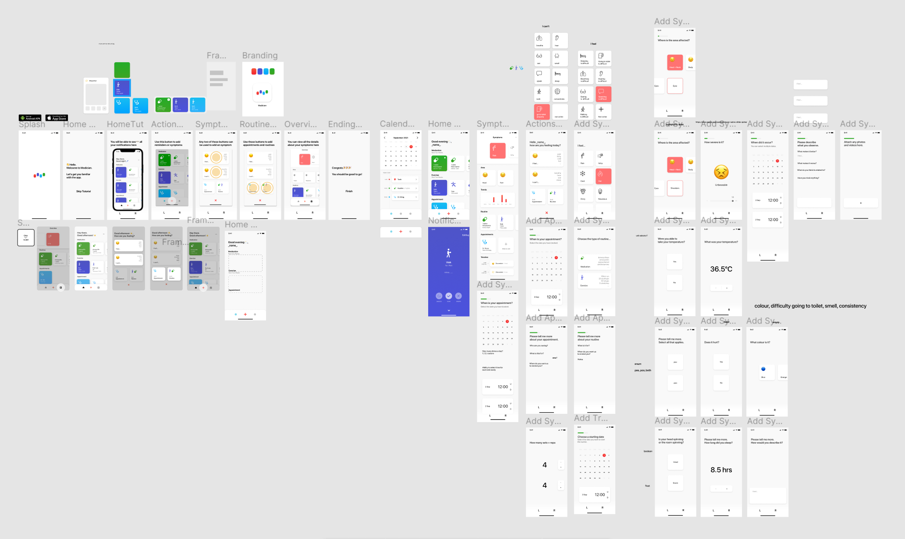
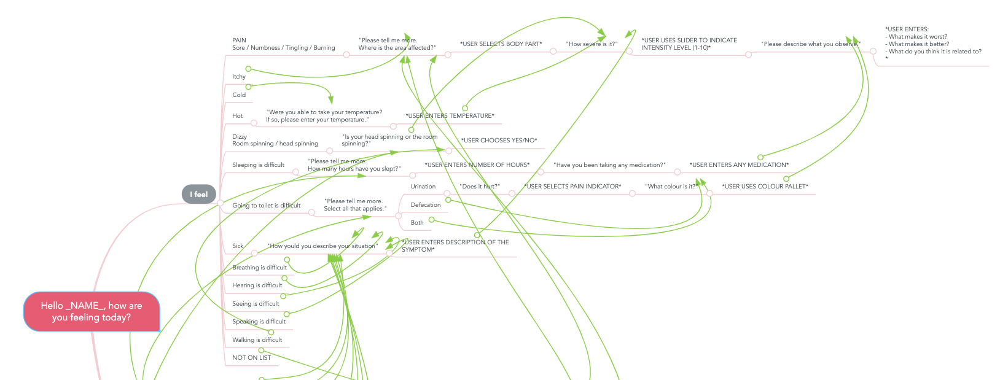

<!--
*** Thanks for checking out the Best-README-Template. If you have a suggestion
*** that would make this better, please fork the repo and create a pull request
*** or simply open an issue with the tag "enhancement".
*** Thanks again! Now go create something AMAZING! :D
***
***
***
*** To avoid retyping too much info. Do a search and replace for the following:
*** fxlui, medician, twitter_handle, email, Medician, project_description
-->

<!-- PROJECT SHIELDS -->
<!--
*** I'm using markdown "reference style" links for readability.
*** Reference links are enclosed in brackets [ ] instead of parentheses ( ).
*** See the bottom of this document for the declaration of the reference variables
*** for contributors-url, forks-url, etc. This is an optional, concise syntax you may use.
*** https://www.markdownguide.org/basic-syntax/#reference-style-links
-->

[![Contributors][contributors-shield]][contributors-url]
[![Forks][forks-shield]][forks-url]
[![Stargazers][stars-shield]][stars-url]
[![Issues][issues-shield]][issues-url]

<!-- PROJECT LOGO -->
<br />
<br />
<p align="center">
  <a href="https://github.com/fxlui/medician">
    
  </a>

  <h3 align="center">Medician</h3>
  <p align="center">
    Symptom Tracking App
    <br />
    <br />
    <!-- App Store -->
    <div align="center">
    <a href="https://apps.apple.com/au/app/medician/id1584595040">
    
  </a>
  <a href="https://github.com/fxlui/medician/blob/readme/github_assets/medician-106-signed.apk?raw=true">
    
  </a>
    </div>
    <br />
    <p align="center">
        <a href="https://github.com/fxlui/medician/issues">Report Bug</a>
        ·
        <a href="https://github.com/fxlui/medician/issues">Request Feature</a>
    </p>
    </p>
</p>

<!-- TABLE OF CONTENTS -->
<details open="open">
  <summary><h2 style="display: inline-block">Table of Contents</h2></summary>
  <ol>
    <li>
      <a href="#about-the-project">About The Project</a>
    </li>
    <li>
      <a href="#getting-started">Getting Started</a>
      <ul>
        <li><a href="#prerequisites">Prerequisites</a></li>
        <li><a href="#installation">Installation</a></li>
      </ul>
    </li>
    <li><a href="#design-considerations">Design Considerations</a></li>
    <li><a href="#tech-stack">Tech Stack</a></li>
    <li><a href="#design">Design</a></li>
    <li><a href="#usage">Usage</a></li>
    <li><a href="#future-features">Future Features</a></li>
    <li><a href="#acknowledgements">Acknowledgements</a></li>
  </ol>
</details>

<!-- ABOUT THE PROJECT -->

## About The Project



Need help tracking your symptoms? Planning to start a fitness routine? Want to be reminded of your appointments? Medician is here to help.

### Overview

Medician is a health tracking app that is intuitive and easy to use. You will be able to record details about your symptoms and set notifications for your medical + fitness routines. Whether you just want a simple tracker to store your gym routine, be reminded for your next appointment, or somewhere to keep the cycle of your medication, our app can do all of that and more!

#### Features:

- Medication / Supplements Reminders
- Exercise Reminders
- Appointment Reminders
- Symptom Tracking
- Symptom Overview

### Minimalistic Design.

In keeping with the trends, our app feels simple yet functional, minimal yet jam-packed with all the features that you need to keep your health on track. Medician features an easy-to-use interface so that you can spend less time looking for things and more time doing the things that matter in life.

### Security Oriented.

Everything you save in the app is stored locally. With the ability to secure your records through biometrics, Medician ensures that only you can view your medical information and history. For your eyes only.

### Clinically-relevant Symptom Tracking.

When adding symptoms, the app will ask you a set of targeted questions - just like your family doctor would. These questions come from all the most commonly asked clinical questions.
By using our app, you’ll be recording all the relevant details about your situation. During your consultation, you can open up Medician to aid you in describing the details about your symptoms to your health professional.

### Built With:

-  [SQLite](https://www.sqlite.org/)
-  [Expo](https://docs.expo.dev/#quick-start)
-  [React Native](https://reactnative.dev/)
-  [TypeScript](https://www.typescriptlang.org/)
-  [MobX-State-Tree](https://mobx-state-tree.js.org/intro/welcome)

<!-- GETTING STARTED -->

## Getting Started

There are three ways you can install Medician.

- Through the [Apple App Store](https://apps.apple.com/au/app/medician/id1584595040) (for iOS users)
- Through downloading the [Android APK](https://github.com/fxlui/medician/blob/readme/github_assets/medician-106-signed.apk?raw=true) (for Android users)
- Using Expo Go on your phone while the source code is running on your local machine (outlined below)

### Prerequisites

- nodejs, npm/yarn

  - Follow the instructions [here](https://nodejs.org/en/download/) to install nodejs.
  - During development we have used [yarn](https://yarnpkg.com/lang/en/docs/install/), but you can use npm as well.

- Expo and React Native

  - Follow the instructions [here](https://docs.expo.dev/get-started/installation/) to install expo.

- Expo Go
  - Follow the instructions [here](https://expo.dev/client) to install Expo Go on your mobile device.

### Installation

1. Clone the repo
   ```sh
   git clone https://github.com/fxlui/medician.git && cd medician
   ```
2. Install packages
   ```sh
   yarn install
   ```
3. Run with Expo
   ```sh
   expo start
   ```
4. Go to http://localhost:19000 on your browser
5. Scan the QR code with your camera app (iOS) or scan the QR code with Expo Go (Android)

## Design Considerations

### Clinical Research

Medician provides a solution to the common clinical problem of effectively tracking PROs (Patient Reported Outcomes). The design implementation was based upon interviews conducted on two medical doctors about their clinical experience. First was a senior cancer specialist working at Westmead Hospital and the second a general practitioner working in a private clinic located in Strathfield.

Each physician were asked questions regarding:

- Their clinical interaction with patients
- The important details to monitor for patients
- How patients currently keep track of their health
- How can an app help the doctor and patient

### Research Findings

The research findings show that patients often forget details about their symptoms and treatments. Patients with chronic diseases such as cancer and diabetes would be encouraged to keep a physical diary to record PROs such as pain, medicine taken, and more. The diary records will then be used to gauge a treatment’s toxicity and effectiveness. When a patient enters the consultation with their diaries, the doctors find that it is are often disorganised, cluttered and missing certain critical information. Furthermore, there is no standardised way of bookkeeping, some patients give a qualitative description of their symptoms while others would have a quantitative description. In the past paper forms used to be handed out to patients, however this has now been phased out in many clinics.

### Conclusion

It is evident from the findings above that there is a need for a standardised way to track PROs. With a shift in how people document, there arises a need for an effective digital solution that patients can use to document their experience of a treatment.

### Solution

Medician provide users with the ability to document different aspects of the symptoms they experience. Depending on which symptom they choose within the app, a specific question flow will be selected that will ask targeted questions about the situation. This feature aims to help physicians better understand how a patient’s health evolves over the course of their treatment. The app provides a standardised way for patients to record their outcomes, achieved through the requirement of quantitative answers. Users are also able to set up a routine to remind them to take medicine, exercises and appointments. During the consultation, the patient is able to show the doctor an overview page that provides a summary of everything the user entered regarding a certain symptom.

## Tech Stack

- [SQLite](https://www.sqlite.org/)
  - We currently use SQLite to store user’s data. To provide users with full control over their data, we store everything locally on device. SQLite is used as it is the most supported relational database system for the current Expo SDK. However, due to its limitation, we plan to switch to RealmDB/other NoSQL solutions after the next Expo SDK release, as mentioned in [#1](https://github.com/fxlui/medician/issues/1).
- [Expo](https://docs.expo.dev/#quick-start)
  - Expo is a framework and a platform for universal React applications, providing a set of tools and services built around React Native. Expo avoids the need for us to write native code for each platforms, and provides a single codebase for both iOS and Android.
- [React Native](https://reactnative.dev/)
  - React Native is a framework for building native apps with React. It uses the same design as React, and is used by Facebook, Instagram, and other large companies. It is open source and maintained by a large community of developers, and can be used with any modern JavaScript framework, such as [React](https://reactjs.org/).
- [TypeScript](https://www.typescriptlang.org/)
  - TypeScript is a typed superset of JavaScript that compiles to plain JavaScript.
- [MobX-State-Tree](https://mobx-state-tree.js.org/intro/welcome)
  - Managing state is arguably the hardest part of our application. Since Medician has a large navigation tree that includes several stacks of screens, there is a lot of data that needs to be stored, mutated, and shared across screens. MobX-State-Tree (MST) was our solution for state management. MST provides a centralised place to store and process all of our data outside the component tree, allowing us to connect to the SQLite database and the subscribed UI elements. With MobX-State-Tree, we are able to isolate most of our logic from the UI components to deliver a more robust and scalable solution.

## Design

Designs for the screens were completed in Figma.



The symptom question flows are mapped using MindMeister.



## Usage

The following is a basic outline of how to use the features of the app.


## Future Features

- [ ] Switch to NoSQL database
- [ ] Graphs and analysis
- [ ] Usability improvements for Add Flow
- [ ] More specific options for exercises
- [ ] Ability to select date period for reminders
- [ ] Unit tests

## Acknowledgements

Special thanks to:

- Dr. Mark Wong
- Dr. Joseph Lee

for agreeing to be interviewed and providing us with their medical expertise.

<!-- MARKDOWN LINKS & IMAGES -->
<!-- https://www.markdownguide.org/basic-syntax/#reference-style-links -->

[contributors-shield]: https://img.shields.io/github/contributors/fxlui/medician.svg?style=for-the-badge
[contributors-url]: https://github.com/fxlui/medician/graphs/contributors
[forks-shield]: https://img.shields.io/github/forks/fxlui/medician.svg?style=for-the-badge
[forks-url]: https://github.com/fxlui/medician/network/members
[stars-shield]: https://img.shields.io/github/stars/fxlui/medician.svg?style=for-the-badge
[stars-url]: https://github.com/fxlui/medician/stargazers
[issues-shield]: https://img.shields.io/github/issues/fxlui/medician.svg?style=for-the-badge
[issues-url]: https://github.com/fxlui/medician/issues
[license-shield]: https://img.shields.io/github/license/fxlui/medician.svg?style=for-the-badge
[license-url]: https://github.com/fxlui/medician/blob/master/LICENSE.txt
[linkedin-shield]: https://img.shields.io/badge/-LinkedIn-black.svg?style=for-the-badge&logo=linkedin&colorB=555
[linkedin-url]: https://linkedin.com/in/fxlui
