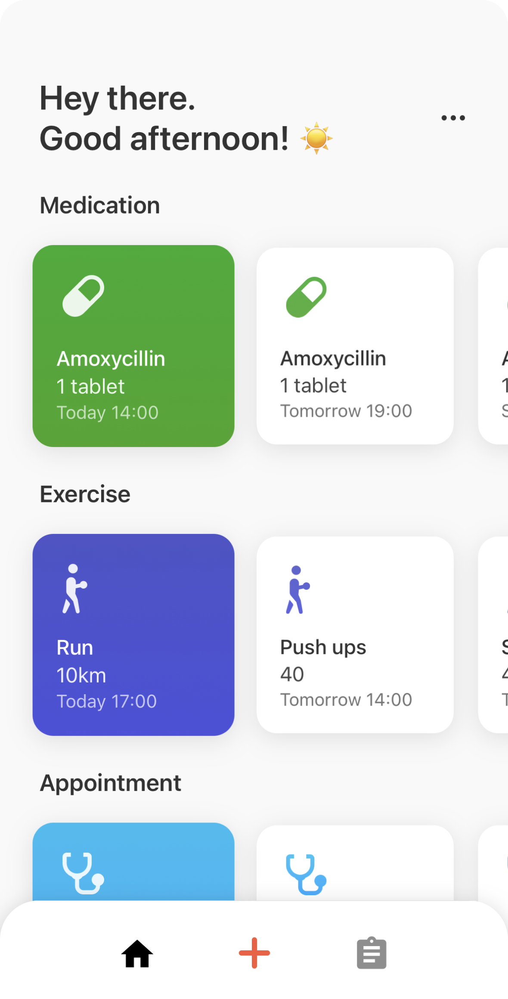

<!--
*** Thanks for checking out the Best-README-Template. If you have a suggestion
*** that would make this better, please fork the repo and create a pull request
*** or simply open an issue with the tag "enhancement".
*** Thanks again! Now go create something AMAZING! :D
***
***
***
*** To avoid retyping too much info. Do a search and replace for the following:
*** fxlui, medician, twitter_handle, email, Medician, project_description
-->

<!-- PROJECT SHIELDS -->
<!--
*** I'm using markdown "reference style" links for readability.
*** Reference links are enclosed in brackets [ ] instead of parentheses ( ).
*** See the bottom of this document for the declaration of the reference variables
*** for contributors-url, forks-url, etc. This is an optional, concise syntax you may use.
*** https://www.markdownguide.org/basic-syntax/#reference-style-links
-->

[![Contributors][contributors-shield]][contributors-url]
[![Forks][forks-shield]][forks-url]
[![Stargazers][stars-shield]][stars-url]
[![Issues][issues-shield]][issues-url]

<!-- PROJECT LOGO -->
<br />
<p align="center">
  <a href="https://github.com/fxlui/medician">
    
  </a>

  <h3 align="center">Medician</h3>

  <p align="center" style="display: flex; flex-direction: column">
    Health Tracking App
    <br />
    <br />
    <!-- App Store -->
    <div align="center">
  <a href="">
    
  </a>
    <a href="https://apps.apple.com/au/app/medician/id1584595040">
    
  </a>
    </div>
    <p align="center">
        <a href="https://github.com/fxlui/medician/issues">Report Bug</a>
        ·
        <a href="https://github.com/fxlui/medician/issues">Request Feature</a>
    </p>
    </p>
</p>

<!-- TABLE OF CONTENTS -->
<details open="open">
  <summary><h2 style="display: inline-block">Table of Contents</h2></summary>
  <ol>
    <li>
      <a href="#about-the-project">About The Project</a>
      <ul>
        <li><a href="#built-with">Built With</a></li>
      </ul>
    </li>
    <li>
      <a href="#getting-started">Getting Started</a>
      <ul>
        <li><a href="#prerequisites">Prerequisites</a></li>
        <li><a href="#installation">Installation</a></li>
      </ul>
    </li>
    <li><a href="#usage">Usage</a></li>
    <li><a href="#roadmap">Roadmap</a></li>
    <li><a href="#contributing">Contributing</a></li>
    <li><a href="#license">License</a></li>
    <li><a href="#contact">Contact</a></li>
    <li><a href="#acknowledgements">Acknowledgements</a></li>
  </ol>
</details>

<!-- ABOUT THE PROJECT -->

## About The Project



Planning to start a fitness routine? Want to be reminded of your appointments? Medician is here to help.

### Overview

Medician is a health tracking app that is intuitive and easy to use. You will be able to record details about your symptoms and set notifications for your medical + fitness routines. Whether you just want a simple tracker to store your gym routine, be reminded for your next appointment, or somewhere to keep the cycle of your medication, our app can do all of that and more!

#### Features:

- Medication / Supplements Reminders
- Exercise Reminders
- Appointment Reminders
- Symptom Tracking
- Symptom Overview

### Minimalistic Design.

In keeping with the trends, our app feels simple yet functional, minimal yet jam-packed with all the features that you need to keep your health on track. Medician features an easy-to-use interface so that you can spend less time looking for things and more time doing the things that matter in life.

### Security Oriented.

Everything you save in the app is stored locally. With the ability to secure your records through biometrics, Medician ensures that only you can view your medical information and history. For your eyes only.

### Clinically-relevant Symptom Tracking.

When adding symptoms, the app will ask you a set of targeted questions - just like your family doctor would. These questions come from all the most commonly asked clinical questions.
By using our app, you’ll be recording all the relevant details about your situation. During your consultation, you can open up Medician to aid you in describing the details about your symptoms to your health professional.

### Built With

- [Expo]()
- [TypeScript]()
- [React Native]()
- [MobX State Tree]()

<!-- GETTING STARTED -->

## Getting Started

To get a local copy up and running follow these simple steps.

### Prerequisites

- nodejs, npm/yarn

  - Follow the instructions [here](https://nodejs.org/en/download/) to install nodejs.
  - During development we have used [yarn](https://yarnpkg.com/lang/en/docs/install/), but you can use npm as well.

- Expo and React Native
  - Follow the instructions [here](https://docs.expo.io/versions/latest/) to install expo.

### Installation

1. Clone the repo
   ```sh
   git clone https://github.com/fxlui/medician.git && cd medician
   ```
2. Install packages
   ```sh
   yarn install
   ```
3. Run with Expo
   ```sh
   expo start
   ```

## Design Problem

Medician provides a solution to the common clinical problem of effectively tracking PROs (Patient Reported Outcomes). Users are able to document different aspects regarding their
Symptoms, treatment cycles, exercises and appointments all in one place.

The design implementation was based upon research conducted on two medical doctors and their clinical experience. First was a senior cancer specialist working in Westmead Hospital and the second a general practitioner working at a private clinic located in Strathfield.

Each physician was asked questions regarding:

- Their clinical interaction with patients
- How their work can be simplified
- Current method of patients tracking their health
- What they hope to see in an app

## Tech Stack

Something about tech stack here

## Design

Figma screenshots

<!-- USAGE EXAMPLES

## Usage

Use this space to show useful examples of how a project can be used. Additional screenshots, code examples and demos work well in this space. You may also link to more resources.

_For more examples, please refer to the [Documentation](https://example.com)_-->

<!-- ROADMAP

## Roadmap

See the [open issues](https://github.com/fxlui/medician/issues) for a list of proposed features (and known issues). -->

<!-- CONTRIBUTING -->

## Contributing

Contributions are what make the open source community such an amazing place to learn, inspire, and create. Any contributions you make are **greatly appreciated**.

1. Fork the Project
2. Create your Feature Branch (`git checkout -b feature/AmazingFeature`)
3. Commit your Changes (`git commit -m 'Add some AmazingFeature'`)
4. Push to the Branch (`git push origin feature/AmazingFeature`)
5. Open a Pull Request

<!-- LICENSE

## License

Distributed under the MIT License. See `LICENSE` for more information.-->

<!-- CONTACT -->

## Contact

Project Link: [https://github.com/fxlui/medician](https://github.com/fxlui/medician)

<!-- ACKNOWLEDGEMENTS

## Acknowledgements

- []()
- []()
- []() -->

<!-- MARKDOWN LINKS & IMAGES -->
<!-- https://www.markdownguide.org/basic-syntax/#reference-style-links -->

[contributors-shield]: https://img.shields.io/github/contributors/fxlui/repo.svg?style=for-the-badge
[contributors-url]: https://github.com/fxlui/medician/graphs/contributors
[forks-shield]: https://img.shields.io/github/forks/fxlui/repo.svg?style=for-the-badge
[forks-url]: https://github.com/fxlui/medician/network/members
[stars-shield]: https://img.shields.io/github/stars/fxlui/repo.svg?style=for-the-badge
[stars-url]: https://github.com/fxlui/medician/stargazers
[issues-shield]: https://img.shields.io/github/issues/fxlui/repo.svg?style=for-the-badge
[issues-url]: https://github.com/fxlui/medician/issues
[license-shield]: https://img.shields.io/github/license/fxlui/repo.svg?style=for-the-badge
[license-url]: https://github.com/fxlui/medician/blob/master/LICENSE.txt
[linkedin-shield]: https://img.shields.io/badge/-LinkedIn-black.svg?style=for-the-badge&logo=linkedin&colorB=555
[linkedin-url]: https://linkedin.com/in/fxlui
